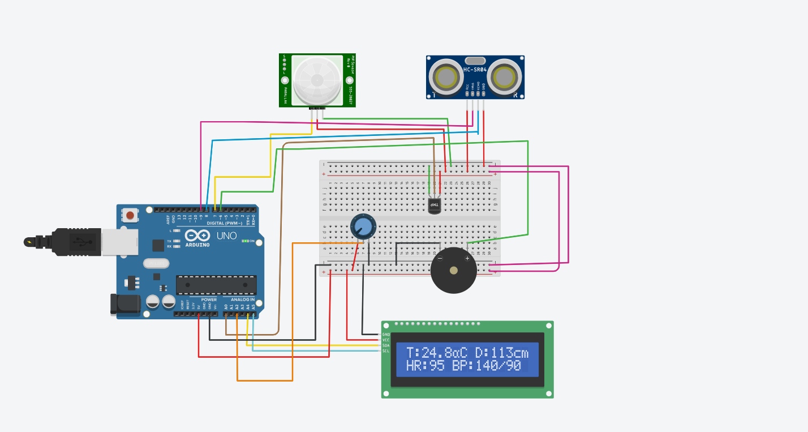

# Smart Healthcare System (Arduino + Tinkercad)

🚑 An IoT-inspired smart healthcare monitoring system built using **Arduino Uno** and simulated in **Tinkercad**.

## Features
- 🌡️ Body Temperature Monitoring (TMP36 sensor)
- 📏 Social Distance Monitoring (Ultrasonic HC-SR04)
- 🏃 Motion Detection (PIR sensor)
- 💓 Heart Rate Simulation (70–100 BPM, random)
- 🩺 Blood Pressure Simulation (Potentiometer mapped to Systolic/Diastolic)
- 🔔 Buzzer Alerts for Fever, Motion, or Unsafe Distance
- 📟 I2C LCD Display for real-time vitals

## Circuit
  

## LCD Output
